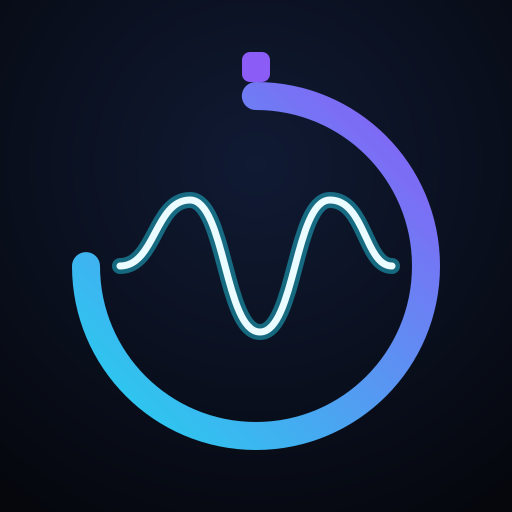
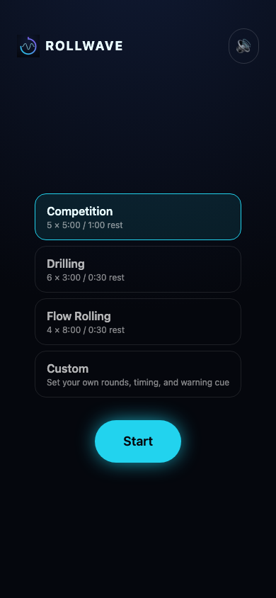
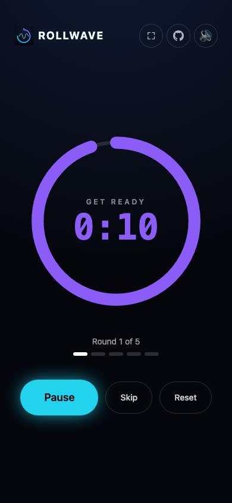

<p align="center">
  
</p>

<h1 align="center">ROLLWAVE</h1>
<p align="center">A futuristic round timer for BJJ training, drilling, and competition.</p>

<p align="center">
  
  
</p>

## Features

- **Presets** for Competition, Drilling, Flow Rolling, and Open Mat (unlimited rounds — keeps going until you stop it), plus unlimited named **custom modes** you create, edit, and revisit later
- **Drift-free timer engine** — stays accurate even if the tab is backgrounded or the phone sleeps mid-round
- **Voice cues** ("Round 1", "Go", "Rest", a spoken 4-3-2-1 countdown near round end, "Session complete") from pre-generated audio clips — no janky in-browser text-to-speech, identical on every device — plus a bright chime as each round starts and a deep bell as it ends. Pick from 3 distinct voices (Onyx, Nova, Fable) on the setup screen
- **Timer ring** drains from a full, bold arc down to empty as each phase elapses, iOS Clock–style
- **Light and dark mode**, following your system preference by default with a manual Auto/Light/Dark override on the setup screen
- **Session history**: a streak counter and per-session log (rounds completed, duration) saved locally, viewable from the setup screen
- **Wake Lock** keeps the screen on during a session; **vibration** pulses on phase changes (Android); optional live clock readout
- **Keyboard shortcuts** for laptop use — `space` start/pause, `r` reset, `s` / `→` skip
- **Fullscreen mode** and a layout that scales up on laptop/tablet screens
- **Installable PWA** — works offline, installs to your home screen on iOS/Android/desktop
- Accessible: ARIA live region announces phase changes for screen readers

## Built-in preset defaults

The single source of truth is [`src/lib/presets.ts`](./src/lib/presets.ts) — update the table below to match if those values change.

| Preset | Rounds | Round length | Rest length | Get ready | Warning at |
| --- | --- | --- | --- | --- | --- |
| Competition | 5 | 5:00 | 1:00 | 10s | 10s left |
| Drilling | 6 | 3:00 | 0:30 | 10s | 10s left |
| Flow Rolling | 4 | 8:00 | 0:30 | 10s | 10s left |
| Open Mat | Unlimited | 5:00 | 1:00 | 10s | 10s left |

## Development

```bash
npm install
npm run dev
```

```bash
npm test           # run the timer engine's unit tests
npm run build      # typecheck + production build
npm run preview    # serve the production build locally
```

### Regenerating assets

Voice clips and icons are pre-generated and committed — the deployed app never calls any external API. To regenerate them after changing the clip manifest, the voice list, or the logo:

```bash
OPENAI_API_KEY=sk-... npm run generate:audio   # public/audio/<voice>/*.mp3, for every voice in VOICE_OPTIONS
npm run generate:icons                         # public/icons/*, favicon.ico
```

See [`CLAUDE.md`](./CLAUDE.md) for architecture notes and more detail.

## Deployment

Pushes to `main` build and deploy automatically to GitHub Pages via `.github/workflows/deploy.yml`.

## Credits

Inspired by [bjj-timer.com](https://bjj-timer.com) ([source](https://github.com/sfw185/BJJTimer)) and [bjjchat.com](https://bjjchat.com/tools/round-timer)'s round timer tools.
